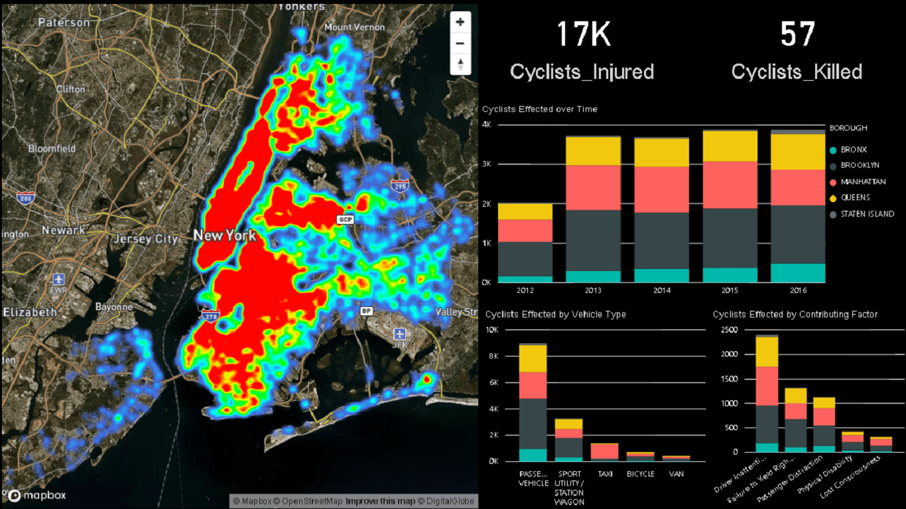
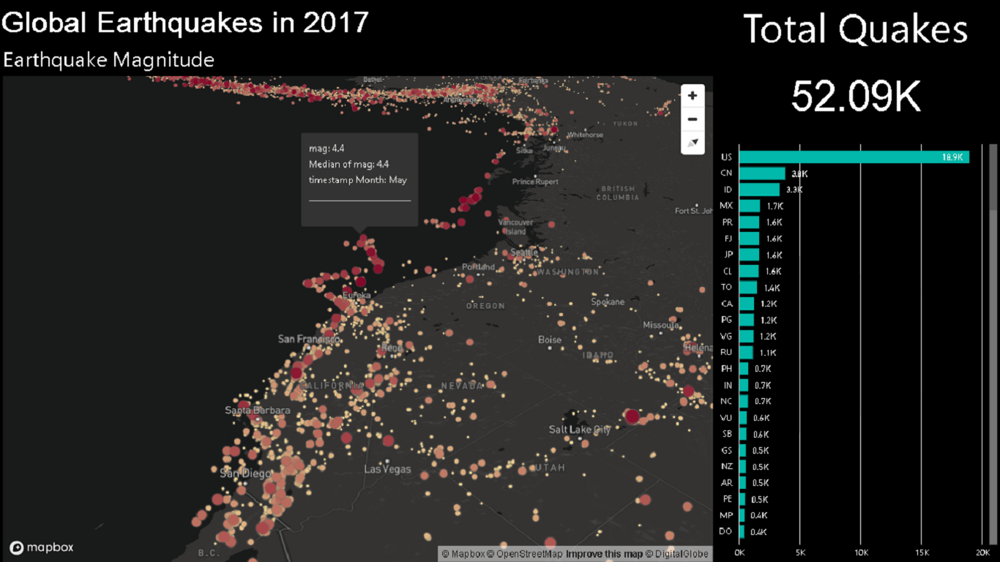
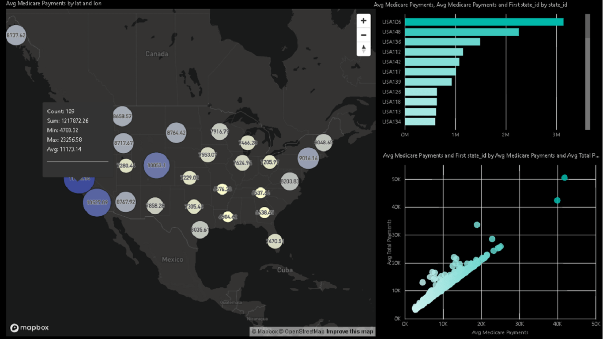
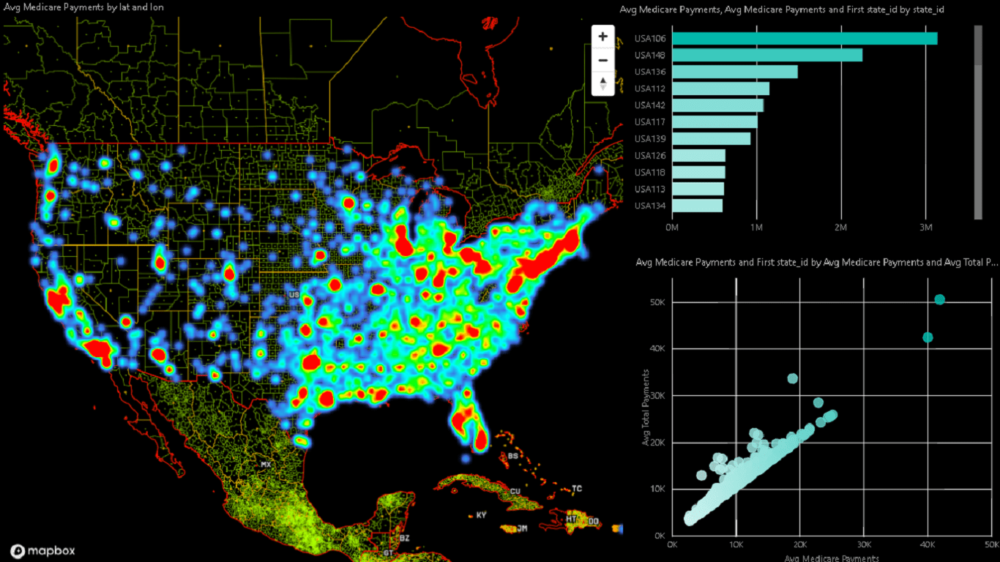

# Mapbox Visual for Power BI

Make sense of your big & dynamic location data with the Mapbox Visual for Power BI.  Quickly design high-performance map visuals using graduated circles, clusters, and interactive heatmaps.  Even customize your Mapbox visual with custom shapes, imagery, and design using [Mapbox Studio](www.mapbox.com/studio).  Check out the [Mapbox Gallery](https://www.mapbox.com/gallery/) to get a sense of what's possible with Studio.

Comming soon as a PowerBI Custom Visual to the Microsoft Office Store.

**The Mapbox Visual for Power BI supports Power BI Desktop and Power BI Online using Chrome or Firefox browsers**


### Examples

* [Example Dashboard - NYC Cycling Incidents](https://www.mapbox.com/bites/00369)
* [Example Dashboard - 2017 USGS Earthquakes](https://app.powerbi.com/view?r=eyJrIjoiNTlkMzA5N2MtNGU0ZS00MDY5LTg1NTktNTZkODkyMmJjOThmIiwidCI6IjYyOWE3MGIyLTMyYjktNDEyNi05NTFlLTE3NjA0Y2Y0NTZlYyIsImMiOjF9)

### Adding MapboxGL Viz to a PowerBI Report

On Power BI Online, add the [dist/mapboxGLMap.pbiviz](https://github.com/mapbox/mapboxgl-powerbi/raw/master/dist/mapboxGLMap.pbiviz) file in this repository as a custom visual in your report.


## Developing

- `npm install -g powerbi-visuals-tools`
- Follow Steps on https://github.com/Microsoft/PowerBI-visuals/blob/master/tools/CertificateSetup.md to setup your PowerBI live visual
- `npm install`
- Log into your PowerBI web UI and enable dev tools https://github.com/Microsoft/PowerBI-visuals/blob/master/tools/DebugVisualSetup.md
- `npm start`
- Add a custom visual using the PowerBI custom viz options, using a latitude and longitude variable.

### Developing under MacOS

Due to an open PowerBI [issue](https://github.com/Microsoft/PowerBI-visuals-tools/issues/157) the `npm start` might fail with `FSEvents.framework`.

To mitigate the issue for powerbi-visuals-tools version 1.10.0 may run
```
git apply VisualBuilder-1.10.0.patch
```

### Running the tests
Please consult the [README.md](test/README.md) in the `/test` folder for futher details.

### Building

`npm run package`
The packaged output `pbiviz` file will be in the `/dist` folder.

### Updating Mapbox GL JS to latest version

Due to an open PowerBI [issue](https://github.com/Microsoft/PowerBI-visuals/issues/165) mapbox-gl.js needs to be copied from under `node_modules` to `src/modules` and patched. During the patch all `window.devicePixelRatio` needs to be replaced to `window.window.devicePixelRatio`.  

This custom-altered version of the Mapbox GL js library is packaged with this repository and will need to be manually checked and validated for new mapboxgl JS version upgrades.

### Screenshots





